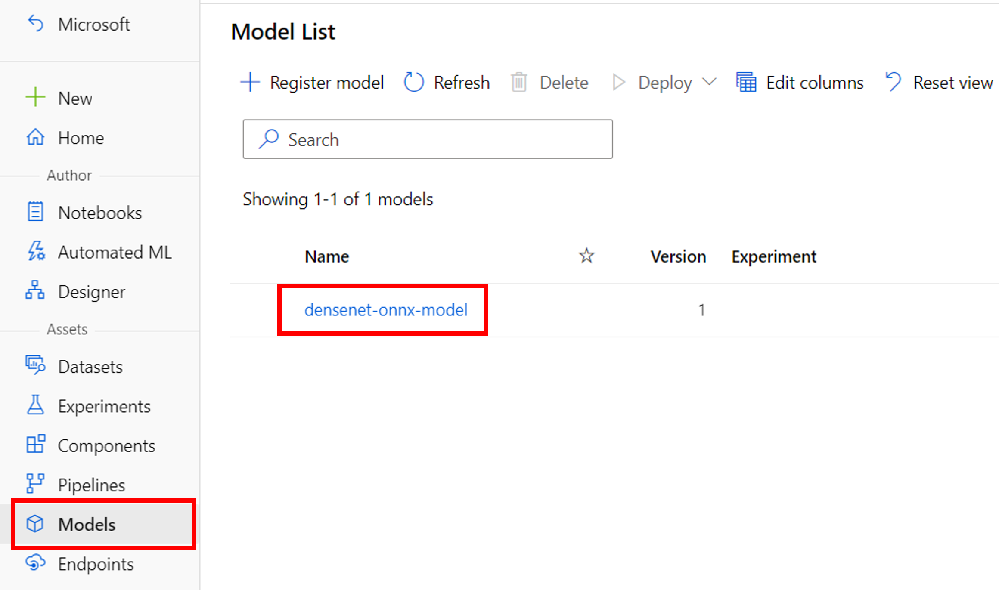
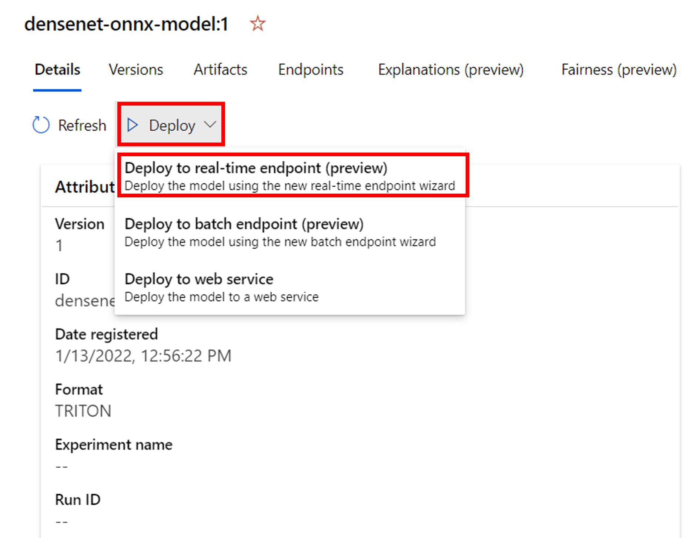

---
lab:
    title: 'Deploy Triton with an ONNX model to a managed online endpoint'
    module: 'Module: Deploy deep learning workloads to production with Azure Machine Learning'
---

# Deploy Triton with an ONNX model to a managed online endpoint

To deploy a model to an endpoint in Azure Machine Learning, you can use NVIDIA Triton Inference Server. In this exercise, you'll register an ONNX model that is already trained to the workspace. Deploying to an endpoint will be easy thanks to Triton's no-code-deployment option.

## Before you start

If you have not already done so, complete the *[Set-up](00-set-up.md)* exercise to create an Azure Machine Learning workspace, compute instance, and to clone the notebooks required for this exercise. A compute cluster is not needed for this exercise.

## Register the model

For Triton no-code-deployment, a model needs to be registered to the Azure Machine Learning workspace with format set to Triton. To do this, you'll use the CLI v2 in the terminal hosted by the compute instance.

1. In [Azure Machine Learning studio](https://ml.azure.com), view the **Compute** page for your workspace. 
2. On the **Compute Instances** tab, start your compute instance if it is not already running.
3. Navigate to the **Notebooks** page in the Studio.
4. Select **Terminal** or the **Open terminal** icon to open a terminal, and ensure that its **Compute** is set to your compute instance.
5. In the terminal, browse to the **/users/*your-user-name*/mslearn-deep-learning/Allfiles/Labs/03-deploy-model** folder with the following command:
    ```bash
    cd mslearn-deep-learning/Allfiles/Labs/03-deploy-model
    ```
6. Enter the following command to avoid any conflicts with previous versions, remove any ML CLI extensions (both version 1 and 2) with this command:

    ```bash
    az extension remove -n azure-cli-ml
    az extension remove -n ml
    ```
7. Install the Azure Machine Learning extension with the following command:
    ```
    az extension add -n ml -y
    ```
8. 
    ```
    az login
    ```
The model is stored in the **models** folder. You'll also find **create-triton-model.yml** which contains the configuration for registering the model. Explore the contents of this YAML file to learn that the registered model will be named **densenet-onnx-model** and the **model_format** is set to **Triton**.

8. In the terminal, run the following command to register the model:
    ```
    az ml model create -f create-triton-model.yml
    ```
9. When the command has completed, go to the **Models** pane to find a new model named **densenet-onnx-model**. 
10. Back on the **Notebooks** page, close the terminal pane to terminating the session.

## Create the endpoint

To create a managed online endpoint, you'll use the Azure Machine Learning Studio. Follow the steps below to deploy the previously registered model.

1. Navigate to the **Models** page, and select the **densenet-onnx-model** to view its details.
 
2. In the **Details** tab, click on **Deploy**. Then, select **Deploy to real-time endpoint**.
 
3. In the **Create deployment** pane, create a managed online endpoint with the following settings:
    - **Endpoint**: New
    - **Endpoint name**: *Enter a unique name. Add random numbers to ensure uniqueness.*
    - **Compute type**: Managed
    - **Authentication type** Key

    - **Select model**: densenet-onnx-model

    - Keep all default settings for the **Deployment** and **Environment**.

    - **Virtual machine size**: Choose **Standard_NC6s_v3** if possible to use GPU. Alternatively, choose **Standard_F4s_v2** to use CPU.
    - **Instance count**: 1
4. Wait for the endpoint to be created and the deployment to be completed. This usually takes around 10 minutes.

> Tip!
> If deployment takes exceptionally long, it may be because the name is not unique. Select the information icon under Provisioning state to go to the Azure portal and get an overview of the deployment of resources. If you see this error, delete the endpoint and deployment, and recreate the endpoint with the Studio.

5. Once deployment is ready, you can find it on the **Endpoints** page of the Azure Machine Learning Studio.
6. In the details overview of your endpoint, go to the **Consume** tab and copy and save the **REST endpoint**.
7. Copy and save the **Primary key** under **Authentication**.
8. Save the endpoint and key for the next part of the exercise, where you'll invoke the endpoint to get the model's predictions.

## Invoke the endpoint

1. Go to the **Notebooks** page in the Studio.
2. Navigate to the **/users/*your-user-name*/mslearn-deep-learning/Allfiles/Labs/03-deploy-model** folder and open the **01-invoke-endpoint.ipynb** notebook.
3. Read the instructions carefully to update necessary parameters and run all cells.

## Stop your compute instance when done with the exercises

If you've finished exploring Azure Machine Learning for now, you should shut down your compute instance to avoid incurring unnecessary charges in your Azure subscription. The compute cluster automatically scales down to 0 nodes when idle.

1. In Azure Machine Learning studio, on the **Compute** page, select your compute instance.
2. Click **Stop** to stop your compute instance. When it has shut down, its status will change to **Stopped**.

> **Note**: Stopping your compute ensures your subscription won't be charged for compute resources. You will however be charged a small amount for data storage as long as the Azure Machine Learning workspace exists in your subscription. If you have finished exploring Azure Machine Learning, you can delete the Azure Machine Learning workspace and associated resources. However, if you plan to complete any other labs in this series, you will need to repeat this lab to create the workspace and prepare the environment first.
